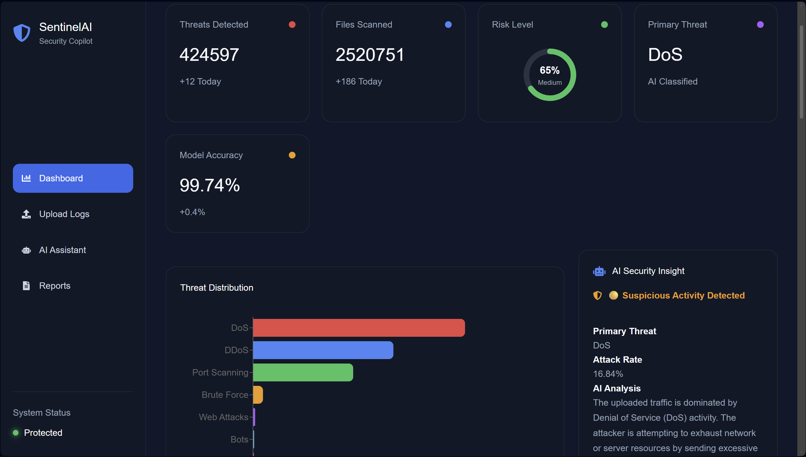
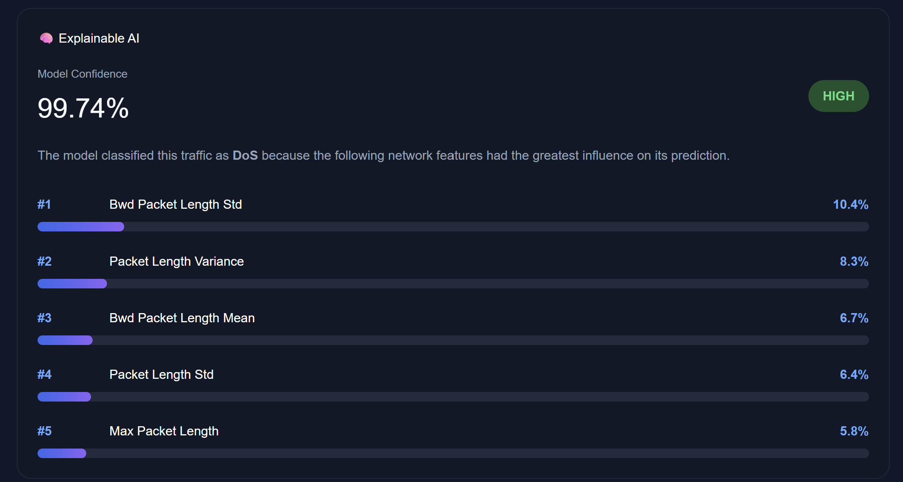
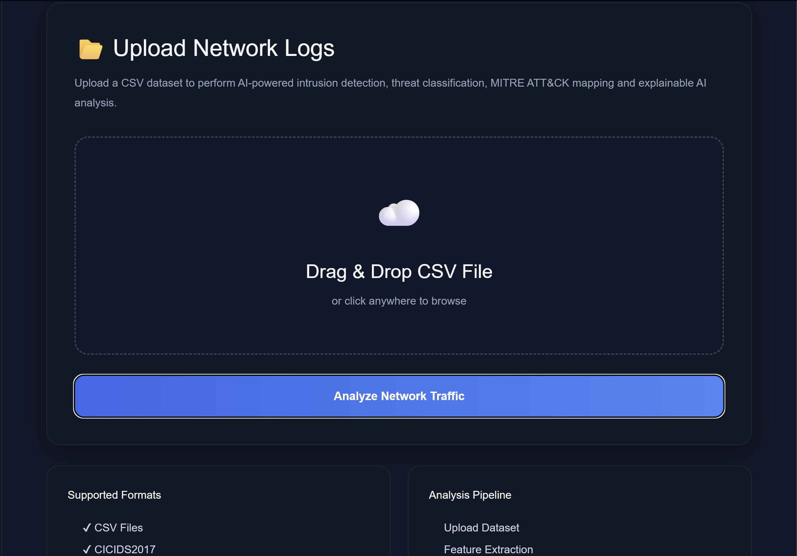
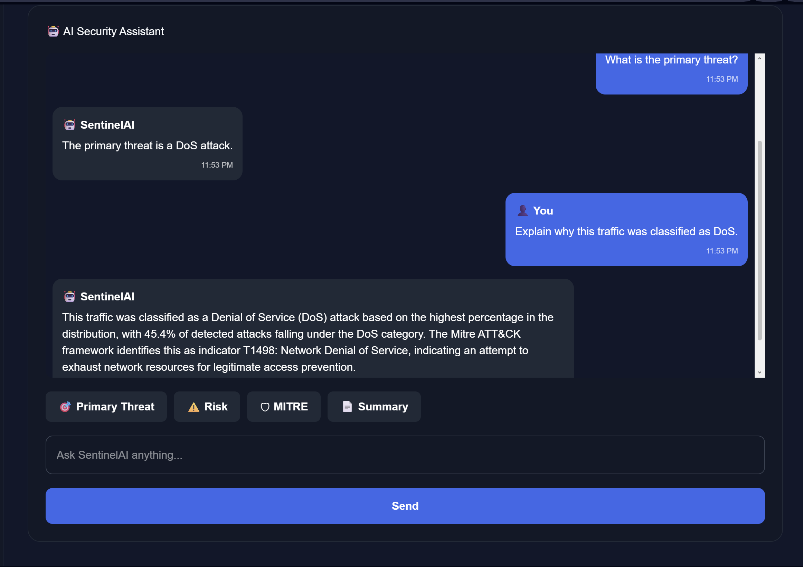
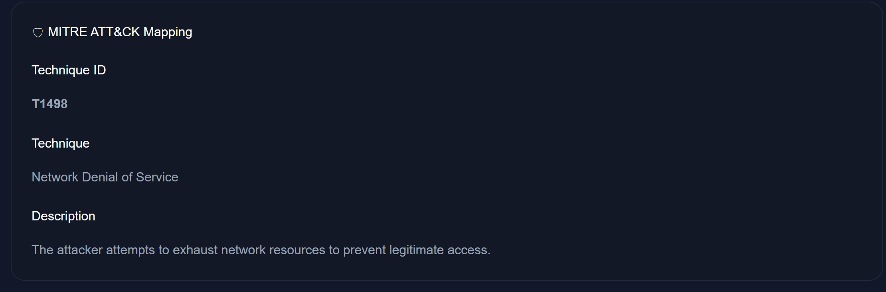
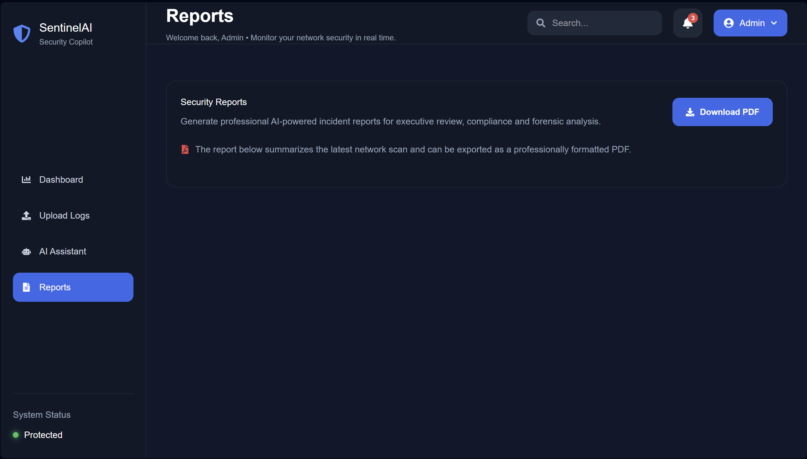
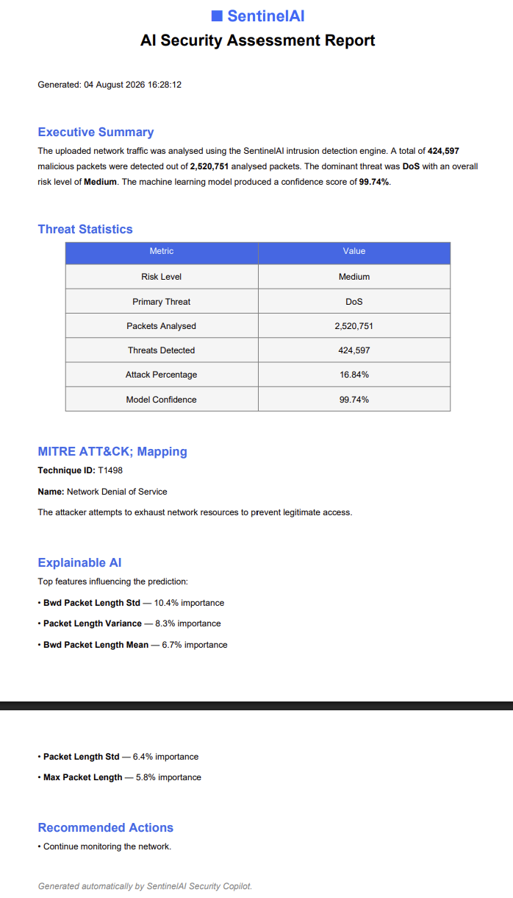

# 🛡️ SentinelAI

### AI-Powered Network Intrusion Detection & Security Copilot

SentinelAI is an AI-powered Network Intrusion Detection and Security Copilot that combines machine learning, explainable AI, MITRE ATT&CK mapping, and a local LLM assistant to help analysts understand and investigate malicious network traffic.


---

## Table of Contents

- [Overview](#overview)
- [Features](#features)
- [Screenshots](#screenshots)
- [Architecture](#architecture)
- [Tech Stack](#tech-stack)
- [Machine Learning Pipeline](#machine-learning-pipeline)
- [Explainability](#explainability)
- [MITRE ATT&CK Mapping](#mitre-attck-mapping)
- [AI Assistant](#ai-assistant)
- [Incident Reporting](#incident-reporting)
- [Project Structure](#project-structure)
- [Installation](#installation)
- [Usage](#usage)
- [API Reference](#api-reference)
- [Dataset](#dataset)
- [Known Limitations](#known-limitations)
- [Future Improvements](#future-improvements)
- [License](#license)
- [Acknowledgements](#acknowledgements)

---

## Overview

Upload a CSV of network flow records and SentinelAI runs it through a two-stage classification pipeline:

1. **Binary intrusion detection** — is this flow normal or an attack?
2. **Attack-family classification** — if malicious, which category (DoS, DDoS, port scan, brute force, etc.)?

The result is stored as the platform's "latest analysis" (in-memory, plus a row appended to a local SQLite scan history), and surfaced across the dashboard, a downloadable PDF report, and a chat assistant that answers questions using that analysis as context.

## Features

**Detection & Classification**
- Binary Random Forest model — normal vs. attack
- Multi-class Random Forest model — attack family classification
- Per-prediction confidence scores (softmax-style max probability)
- Automatic risk-level bucketing (Low / Medium / High based on attack percentage)

**Explainability**
- Top-5 most influential features per scan, derived from the intrusion model's `feature_importances_`
- Rendered as a ranked, percentage-weighted bar list in the dashboard

**MITRE ATT&CK Mapping**
- Detected attack families are mapped to MITRE technique IDs, names, and descriptions via a curated lookup table (DoS, DDoS, Port Scanning, Brute Force, Bots, Web Attacks)

**AI Assistant**
- Chat interface backed by a **local LLM via Ollama** (`qwen2.5:3b`)
- Responses are constrained to the current `latest_analysis` object — the assistant answers from the scan data, not open-ended knowledge
- Quick-action buttons for common questions (primary threat, risk level, MITRE mapping, summary)

**Reporting**
- One-click PDF incident report generated server-side with ReportLab
- Includes executive summary, threat statistics table, MITRE mapping, top explainability features, and recommended actions

**Dashboard**
- Dark-themed React UI polling `/stats` every 3 seconds
- Threat distribution bar chart (Recharts)
- Scan history, trend chart, system health, and live event feed panels

## Screenshots

> Screenshots live in `screenshots/`. Replace/update the images below as the UI evolves.

## Dashboard Overview



The main SOC dashboard showing threat statistics, attack distribution, risk level, and AI-generated security insights.

---

## Explainable AI



Top contributing features used by the Random Forest model together with prediction confidence.

---

## Upload & Analysis



CSV upload workflow that triggers the two-stage intrusion detection and attack classification pipeline.

---

## AI Security Assistant



Local LLM-powered Security Copilot capable of answering questions about the latest network analysis.

---

## MITRE ATT&CK Mapping



MITRE ATT&CK technique mapping for the detected attack, including tactic, technique ID, and description.

---

## Reports



Professional incident reporting interface with downloadable PDF reports.

---

## Generated PDF Report



Automatically generated executive incident report containing attack statistics, business impact, MITRE mapping, explainable AI summary, and remediation recommendations..

## Architecture

## Architecture



```mermaid
flowchart TD
    User(["👤 User"])

    subgraph FE["🖥️ Frontend — React 19 + Vite"]
        direction TB
        subgraph FEIN[" "]
            direction LR
            Upload["Upload Page"]
            Assist["AI Assistant"]
        end
        subgraph FEOUT[" "]
            direction LR
            Dash["Dashboard"]
            ReportsPage["Reports"]
        end
    end

    subgraph BE["⚙️ Backend — FastAPI Backend"]
        direction TB
        API["FastAPI Backend"]
        Proc["Upload & Analysis Engine"]
        Orch["AI Orchestrator"]
        PDF["PDF Report Builder · ReportLab"]
    end

    subgraph ML["🧠 Machine Learning — Two-Stage Classification Pipeline"]
        direction TB
        IDM["Stage 1 · Intrusion Detection Model\n(Random Forest · .pkl)"]
        ACM["Stage 2 · Attack Classification Model\n(Random Forest · .pkl)"]
        OUT["Outputs\nAttack Type · Confidence Score · Risk Level"]
        IDM --> ACM --> OUT
    end

    subgraph ST["🗄️ Storage — SQLite"]
        direction TB
        DB["Scan History · Analysis Summaries · Upload Metadata"]
    end

    subgraph AIL["🤖 AI Engine — Ollama · qwen2.5:3b"]
        direction TB
        LLM["qwen2.5:3b Inference"]
    end

    User --> FEIN
    FEIN -->|HTTP / REST| API
    API --> Proc
    Proc --> IDM
    OUT --> DB
    OUT --> Orch
    OUT --> PDF
    Orch --> LLM
    LLM --> Orch
    DB --> FEOUT
    Orch -.->|Chat Response| FEOUT
    PDF --> FEOUT

    classDef frontend fill:#1e293b,stroke:#38bdf8,stroke-width:1.5px,color:#f1f5f9
    classDef backend fill:#1e293b,stroke:#22c55e,stroke-width:1.5px,color:#f1f5f9
    classDef ml fill:#1e293b,stroke:#a855f7,stroke-width:1.5px,color:#f1f5f9
    classDef ai fill:#1e293b,stroke:#f59e0b,stroke-width:1.5px,color:#f1f5f9
    classDef storage fill:#1e293b,stroke:#ef4444,stroke-width:1.5px,color:#f1f5f9
    classDef actor fill:#0f172a,stroke:#94a3b8,stroke-width:1.5px,color:#f1f5f9

    class Upload,Assist,Dash,ReportsPage frontend
    class API,Proc,Orch,PDF backend
    class IDM,ACM,OUT ml
    class LLM ai
    class DB storage
    class User actor

    style FE fill:#0f172a,stroke:#38bdf8,stroke-width:2px
    style FEIN fill:#0f172a,stroke:#0f172a
    style FEOUT fill:#0f172a,stroke:#0f172a
    style BE fill:#0f172a,stroke:#22c55e,stroke-width:2px
    style ML fill:#0f172a,stroke:#a855f7,stroke-width:2px
    style ST fill:#0f172a,stroke:#ef4444,stroke-width:2px
    style AIL fill:#0f172a,stroke:#f59e0b,stroke-width:2px
```

The frontend talks to a single FastAPI process over `http://127.0.0.1:8000`. There is no message queue, no separate inference service, and no authentication layer — state (`latest_analysis`) lives in a Python global in the API process.

## Tech Stack

| Layer | Technologies |
|---|---|
| Frontend | React 19, Vite, React Router v7, Tailwind CSS v4, Recharts, Chart.js / react-chartjs-2, React Icons, Axios |
| Backend | FastAPI, Uvicorn, Pydantic |
| Machine Learning | scikit-learn (RandomForestClassifier), pandas, NumPy, joblib |
| AI Assistant | Ollama (local inference), `qwen2.5:3b` |
| Database | SQLite (`sqlite3`, no ORM) |
| Reporting | ReportLab |

## Machine Learning Pipeline

Two independent `RandomForestClassifier` models are trained in `backend/training/`:

| Script | Output | Task |
|---|---|---|
| `train_model.py` | `models/intrusion_model.pkl` | Binary: Normal (0) vs. Attack (1) |
| `train_attack_classifier.py` | `models/attack_classifier.pkl` | Multi-class: specific attack family |

Both are trained on a 300,000-row random sample of a cleaned CICIDS2017 CSV, with an 80/20 stratified train/test split and the following hyperparameters:

```python
RandomForestClassifier(
    n_estimators=150,
    max_depth=20,
    min_samples_split=5,
    random_state=42,
    n_jobs=-1
)
```

At inference time (`POST /upload`), uploaded CSV rows first pass through the binary model; rows flagged as attacks are then routed through the multi-class classifier to determine the specific attack family, which drives the MITRE mapping and AI insight lookup.

## Explainability

Feature importance is read directly from the trained binary model:

```python
feature_names = intrusion_model.feature_names_in_.tolist()
feature_importance = intrusion_model.feature_importances_
```

The top 5 features by importance are attached to every scan result and rendered in the dashboard's Explainable AI panel as ranked, percentage-weighted bars.

> Note: this is native scikit-learn `feature_importances_`, a global (model-level) importance measure — not a per-prediction method like SHAP. If you need per-sample attribution, that would be a future addition (see [Future Improvements](#future-improvements)).

## MITRE ATT&CK Mapping

Detected attack families are mapped to MITRE ATT&CK techniques through a static lookup table in `app/main.py`:

| Attack Type | Technique | ID |
|---|---|---|
| DoS / DDoS | Network Denial of Service | T1498 |
| Port Scanning | Network Service Discovery | T1046 |
| Brute Force | Brute Force | T1110 |
| Bots | Acquire Infrastructure | T1583 |
| Web Attacks | Exploit Public-Facing Application | T1190 |

Unmapped or unrecognized attack labels fall back to an "Unknown" technique entry.

## AI Assistant

The `/assistant` endpoint sends a prompt to a **locally running Ollama instance** (model `qwen2.5:3b`), with the current scan's `latest_analysis` dictionary injected as context and a system-style instruction restricting the model to answer only from that data, in three sentences or fewer. This makes the assistant a grounded Q&A layer over the most recent scan — it does not have access to arbitrary external knowledge or prior scans beyond what's in the analysis object.

Requires Ollama installed and running locally with the model pulled:

```bash
ollama pull qwen2.5:3b
```

## Incident Reporting

`GET /report` builds a PDF on demand using ReportLab, from the same `latest_analysis` state used elsewhere in the app. The report includes:

- Executive summary (packets analyzed, attacks detected, dominant threat, risk level, confidence)
- Threat statistics table
- MITRE ATT&CK technique ID, name, and description
- Top explainability features
- Recommended actions (pulled from the static AI insight lookup for the detected attack type)

## Project Structure

```
AI-Security-Copilot/
├── backend/
│   ├── app/
│   │   ├── main.py              # FastAPI app: upload, stats, history, assistant, report
│   │   └── api/routes.py        # Additional router (health check)
│   ├── dataset/                 # CICIDS2017 CSV goes here (not committed)
│   ├── models/
│   │   ├── intrusion_model.pkl
│   │   └── attack_classifier.pkl
│   ├── sample_logs/
│   │   └── network_logs.csv     # Example upload file
│   ├── training/
│   │   ├── train_model.py
│   │   └── train_attack_classifier.py
│   └── requirements.txt
├── frontend/
│   ├── src/
│   │   ├── pages/               # Dashboard, Upload, Reports, AIAssistant
│   │   ├── components/Dashboard/
│   │   ├── layouts/MainLayout.jsx
│   │   └── services/api.js      # Axios client (baseURL: http://127.0.0.1:8000)
│   └── package.json
├── docs/
│   └── SentinelAI_Incident_Report.pdf   # Example generated report
└── screenshots/
```

## Installation

### Prerequisites
- Node.js (for the frontend)
- Python 3.12
- [Ollama](https://ollama.com) running locally, with `qwen2.5:3b` pulled (required for the AI Assistant)

### Backend

```bash
cd backend
python -m venv .venv
.venv\Scripts\activate        # Windows
# source .venv/bin/activate   # macOS / Linux

pip install -r requirements.txt
uvicorn app.main:app --reload
```

The backend expects to be run from the `backend/` directory — model paths (`models/intrusion_model.pkl`, etc.) and the SQLite file are resolved relative to the working directory.

### Frontend

```bash
cd frontend
npm install
npm run dev
```

The frontend expects the API at `http://127.0.0.1:8000` (hardcoded in `src/services/api.js`).

## Usage

1. Start Ollama and confirm `qwen2.5:3b` is available.
2. Start the backend (`uvicorn app.main:app --reload` from `backend/`).
3. Start the frontend (`npm run dev` from `frontend/`).
4. Open the app, go to **Upload**, and submit a CSV of network flow records (see `backend/sample_logs/network_logs.csv` for the expected format).
5. View results on the **Dashboard**: threat distribution, explainability, MITRE mapping.
6. Ask the **AI Assistant** questions about the scan, or use the quick-action buttons.
7. Generate a PDF from **Reports**.

## API Reference

| Method | Endpoint | Description |
|---|---|---|
| `GET` | `/` | Health/welcome message |
| `POST` | `/upload` | Upload a CSV, run detection + classification, persist to scan history |
| `GET` | `/stats` | Return the latest analysis object |
| `GET` | `/history` | Return the last 20 scans from SQLite |
| `POST` | `/assistant` | Ask a question, answered by the local LLM using `latest_analysis` as context |
| `GET` | `/report` | Generate and download a PDF incident report |

## Dataset

The training dataset (**CICIDS2017**) is **not included** in this repository due to its size. Download it from the Canadian Institute for Cybersecurity:

🔗 https://www.unb.ca/cic/datasets/ids-2017.html

After downloading and cleaning, place it at:

```
backend/dataset/cicids2017_cleaned.csv
```

**Trained models are already included** (`backend/models/*.pkl`), so the application runs and serves predictions immediately without retraining.

## Known Limitations

- No authentication or multi-user support — `latest_analysis` is a single shared in-memory object.
- Explainability is model-level (`feature_importances_`), not per-prediction (e.g. SHAP).
- MITRE mapping and per-attack "AI insight" text (summary/impact/recommendations) are static lookup tables, not generated by the model or the LLM.
- The AI Assistant depends on a locally running Ollama instance; there's no fallback if it's unavailable beyond a generic error message in the chat UI.
- `backend/app/api/routes.py` defines a `/health` route that is not currently mounted on the FastAPI app.

## Future Improvements

- Add per-prediction explainability (e.g. SHAP) alongside the existing global feature importances
- Add authentication and per-user scan history
- Containerize backend + frontend + Ollama for one-command startup
- Persist `latest_analysis` in SQLite instead of an in-memory global, so it survives restarts
- Add automated tests for the FastAPI endpoints and the training pipeline

## License

This project is licensed under the MIT License - see the [LICENSE](LICENSE) file for details.

## Acknowledgements

- [CICIDS2017 Dataset](https://www.unb.ca/cic/datasets/ids-2017.html) — Canadian Institute for Cybersecurity
- [MITRE ATT&CK®](https://attack.mitre.org/) — technique reference framework
- [Ollama](https://ollama.com) — local LLM runtime
